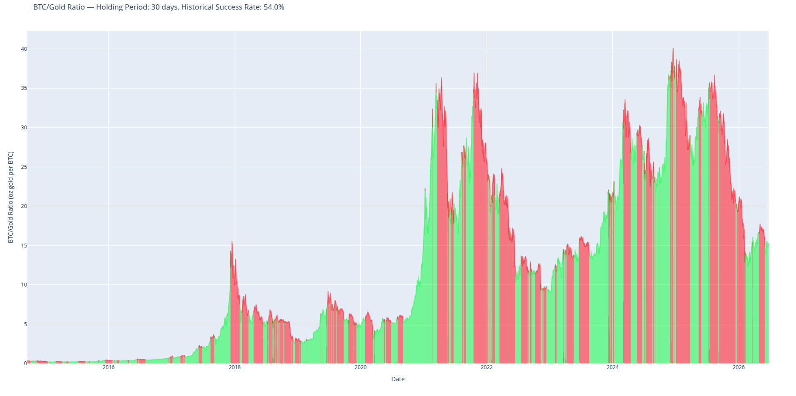
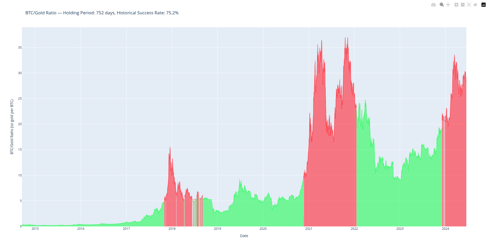

# Sound Money Ratio

Live at [nathanjs1703.github.io/sound-money-ratio](https://nathanjs1703.github.io/sound-money-ratio/) — no install required.

The proportion of all possible entry dates on which bitcoin went on to outperform gold, or gold bitcoin, across their full shared history.

| Short holds | Long holds |
|:---:|:---:|
|  |  |
| Gold base, 30-day hold · as of 2026-07-14 · near even | Gold base, 752-day hold · as of 2026-07-14 · 75.2% of windows profitable |

## What this answers

If you own bitcoin or gold and are considering trading into the other asset and holding for a while, what are the chances you end up with more than what you started with?

The future is opaque, but the past is not. For every day in the price history where someone could have made that trade, this tool checks whether holding for your chosen period would have left them ahead or behind. The share of windows that came out ahead is the answer the tool gives you.

Most bitcoin and gold analysis is denominated in dollars. However, with constant historical debasement distorting the real economic signal, I feel it is more instructive to see the direct relationship. Measuring the two hard monetary assets directly against each other helps remove some of that distortion. Thus the non-dollar framing and the symmetry between bitcoin and gold are both intentional design philosophies.

## Two applications

This project has two applications for two different audiences.

**[Web app](https://nathanjs1703.github.io/sound-money-ratio/)** — for anyone. Enter a holding period, pick a base asset, and get the answer in your browser. No install, no setup. See the [web app README](web/README.md) for architecture and design decisions.

**[Command-line tool](cli/README.md)** — for people comfortable cloning a repo and running Python locally. See the [CLI README](cli/README.md) for installation, usage, design decisions, and known limitations.

Both applications share a single analytical core (`sound_money_core.py`) and produce identical results.

## Contact

Bug reports and questions: please [open an issue](https://github.com/nathanjs1703/sound-money-ratio/issues).

For anything else, reach me at the email on my [GitHub profile](https://github.com/nathanjs1703).

## License

MIT (see [LICENSE](LICENSE)).
